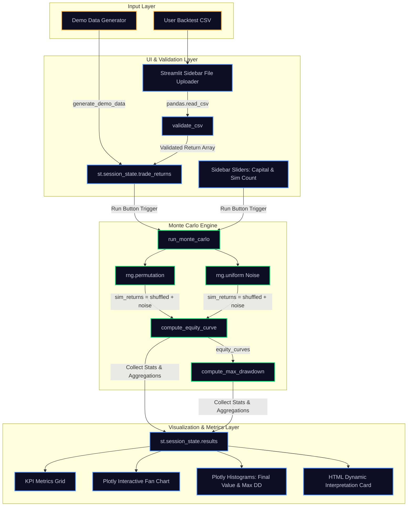

# Technical Analysis & Reverse Engineering Report: Monte Carlo Simulation Dashboard

This report provides a complete technical decomposition, mathematical reverse-engineering, data-flow trace, and risk audit of the Streamlit-based Monte Carlo Simulation Dashboard. It is based strictly on the source code of the dashboard implementation in [monte_carlo_dashboard.py](file:///c:/Users/User/OneDrive/Documents/Python%20Scripts/02%20Monte%20Carlo%20Simulation%20Dashboard/monte_carlo_dashboard.py) and [utils.py](file:///c:/Users/User/OneDrive/Documents/Python%20Scripts/02%20Monte%20Carlo%20Simulation%20Dashboard/utils.py).

---

## Executive Summary

The Monte Carlo Simulation Dashboard ("Nebula") is a risk-evaluation and validation tool designed to assess the sequence risk, compounding volatility, and overfitting potential of systematic trading strategies. Rather than generating synthetic price paths from theoretical distributions (e.g., Geometric Brownian Motion), the simulator uses a **hybrid empirical-historical resampling engine**. It randomizes the chronological sequence of historical trade returns (permutation without replacement) and introduces micro-variations (additive uniform noise) to generate hundreds of alternative equity growth curves.

By comparing the original backtest's performance against this simulated distribution, the dashboard calculates a probability cloud of final values, maximum drawdowns, and a custom **Overfitting Risk** metric ($P$-value rank). 

---

## Phase 1 — Codebase Analysis

The codebase is split into two primary components: a numerical backend ([utils.py](file:///c:/Users/User/OneDrive/Documents/Python%20Scripts/02%20Monte%20Carlo%20Simulation%20Dashboard/utils.py)) and a visual/state frontend ([monte_carlo_dashboard.py](file:///c:/Users/User/OneDrive/Documents/Python%20Scripts/02%20Monte%20Carlo%20Simulation%20Dashboard/monte_carlo_dashboard.py)).

### 1. [utils.py](file:///c:/Users/User/OneDrive/Documents/Python%20Scripts/02%20Monte%20Carlo%20Simulation%20Dashboard/utils.py)
* **File Purpose**: Implements low-level mathematical transformations, file validation, synthetic data generation, and the core Monte Carlo simulation loop.
* **Functional Responsibility**: Isolates the numerical computation from the UI framework, ensuring statistical and algebraic calculations are deterministic (given a seed) and easily testable.
* **Dependencies**: `numpy`, `pandas`, `typing`.
* **Data Flow**:
  * **Input**: Raw trade returns array, starting capital, simulation count, noise settings, seed, or a raw CSV file.
  * **Processing**: Permutation shuffling, uniform noise generation, cumulative compounding, running peak maximum accumulation, percentile calculation, and statistical aggregation.
  * **Output**: Cleaned DataFrames, calculated equity series arrays, scalar drawdown statistics, and aggregated simulation summaries in nested dictionary format.

### 2. [monte_carlo_dashboard.py](file:///c:/Users/User/OneDrive/Documents/Python%20Scripts/02%20Monte%20Carlo%20Simulation%20Dashboard/monte_carlo_dashboard.py)
* **File Purpose**: Manages user interactions, dashboard layout, file uploading, session state persistence, chart rendering, and natural language interpretation.
* **Functional Responsibility**: Acts as the orchestrator. It binds the backend numerical engine to a high-fidelity web dashboard utilizing Custom CSS, Plotly Graph Objects, and responsive column widgets.
* **Dependencies**: `streamlit`, `numpy`, `pandas`, `plotly.graph_objects`, and functions imported from [utils.py](file:///c:/Users/User/OneDrive/Documents/Python%20Scripts/02%20Monte%20Carlo%20Simulation%20Dashboard/utils.py).
* **Data Flow**:
  * **Input**: User uploads a backtest CSV or requests demo data; configures starting capital and simulation paths in the sidebar.
  * **Processing**: Feeds UI inputs to `run_monte_carlo()`; stores simulation objects in `st.session_state`; maps metrics to HTML elements; sets color-coded KPI thresholds; generates percentile bands for the fan chart.
  * **Output**: Interactive metrics grid, animated multi-trace fan chart, outcome histograms, and dynamic HTML-styled interpretation blocks.

### Architecture Map & Data Flow Diagram



---

## Phase 2 — Identify the Monte Carlo Engine

The backend implementation employs **Empirical Return Sequence Randomization (Permutation) with Additive Uniform Noise**. It is a hybrid empirical/heuristic Monte Carlo engine.

Below is an evaluation of the potential models based on evidence in the codebase:

| Model Type | Implemented? | Code Evidence / Analysis | Confidence |
| :--- | :---: | :--- | :---: |
| **Historical Resampling (Bootstrap with replacement)** | **No** | Standard bootstrap draws returns with replacement using `choice(..., replace=True)`. The codebase uses `rng.permutation(returns)` in [utils.py:L138](file:///c:/Users/User/OneDrive/Documents/Python%20Scripts/02%20Monte%20Carlo%20Simulation%20Dashboard/utils.py#L138), preserving the exact sample set without replacement. | 100% |
| **Trade Sequence Randomization (Permutation)** | **Yes** | Shuffles return order using `rng.permutation(returns)`. This breaks chronological dependencies while keeping the exact empirical distribution constant. | 100% |
| **Random Walk / Geometric Brownian Motion** | **No** | No drift ($\mu$), parametric volatility ($\sigma$), or Wiener process ($dW_t$) parameters exist. Simulation relies strictly on empirical trade returns. | 100% |
| **Lognormal Simulation** | **No** | The simulator does not map returns to a lognormal distribution. Compounding is calculated directly as a sequence of discrete percent adjustments ($1 + r_t$). | 100% |
| **Jump Diffusion / Regime-Based** | **No** | No poisson jump intensity, regime classification, or Hidden Markov Models are present in the simulation logic. | 100% |
| **Hybrid Monte Carlo (Permutation + Perturbation)** | **Yes** | The core logic shuffles trade returns and adds a uniform distribution of micro-noise: `shuffled + rng.uniform(-noise_pct, noise_pct, n)`. | 100% |

### Description of the Engine
The engine randomizes the execution order of trades to stress-test sequence vulnerability, then perturbs each trade return with independent and identically distributed (I.I.D.) noise drawn from a uniform distribution:
$$\epsilon_t \sim \text{Uniform}(-0.003, +0.003)$$
This represents transaction-level variance (e.g., slippage, execution delay, bid-ask spread changes).

---

## Phase 3 — Mathematical Reverse Engineering

Every calculation in the codebase is derived here from first principles:

### 1. Equity Curve Compounding
* **Mathematical Formula**:
  $$E_t = E_0 \prod_{i=1}^t (1 + r_i) \quad \text{for } t \in [1, N]$$
  $$E_0 = \text{starting\_capital}$$
* **Variables**:
  * $E_t$: Portfolio equity value immediately after trade $t$.
  * $E_0$: Initial portfolio capital.
  * $r_i$: Fractional return of trade $i$ (e.g., $+1.5\% = 0.015$; $-2.0\% = -0.020$).
  * $N$: Total number of trades in the sequence.
* **Code Reference**: [utils.py:L72-76](file:///c:/Users/User/OneDrive/Documents/Python%20Scripts/02%20Monte%20Carlo%20Simulation%20Dashboard/utils.py#L72-76) in `compute_equity_curve`.
* **Calculation Flow**:
  1. Allocate a float array `equity` of length $N+1$.
  2. Set `equity[0]` to the starting capital $E_0$.
  3. Calculate cumulative product: `np.cumprod(1.0 + returns, out=equity[1:])`.
  4. Multiply all compounded values element-wise by $E_0$.
* **Trading Rationale**: Simulates the compounding effect of re-investing profits and losses.
* **Numerical Example**:
  * $E_0 = \$100,000$
  * $r = [0.10, -0.05, 0.02]$
  * $E_1 = 100,000 \times (1 + 0.10) = \$110,000$
  * $E_2 = 110,000 \times (1 - 0.05) = \$104,500$
  * $E_3 = 104,500 \times (1 + 0.02) = \$106,590$
  * Output array: `[100000.0, 110000.0, 104500.0, 106590.0]`.

### 2. Running Peak & Maximum Drawdown
* **Mathematical Formula**:
  $$Peak_t = \max_{0 \le s \le t} E_s$$
  $$DD_t = \frac{Peak_t - E_t}{Peak_t}$$
  $$MaxDD = \max_{0 \le t \le N} DD_t$$
* **Variables**:
  * $E_t$: Equity value at trade index $t$.
  * $Peak_t$: Running maximum equity value up to trade index $t$.
  * $DD_t$: Calculated drawdown at trade index $t$ (as a fraction of peak).
  * $MaxDD$: Maximum drawdown over the entire equity series.
* **Code Reference**: [utils.py:L79-94](file:///c:/Users/User/OneDrive/Documents/Python%20Scripts/02%20Monte%20Carlo%20Simulation%20Dashboard/utils.py#L79-94) in `compute_max_drawdown`.
* **Calculation Flow**:
  1. Compute the cumulative maximum: `peak = np.maximum.accumulate(equity)`.
  2. Perform element-wise division: `drawdown = (peak - equity) / peak`.
  3. Locate maximum value: `float(drawdown.max())`.
* **Trading Rationale**: Measures the peak-to-trough drop in account equity, determining the worst-case capital decline.
* **Numerical Example**:
  * $E = [1000, 1200, 900, 1300]$
  * $Peak = [1000, 1200, 1200, 1300]$
  * $DD = [0.0, 0.0, \frac{1200-900}{1200}, 0.0] = [0.0, 0.0, 0.25, 0.0]$
  * $MaxDD = 0.25$ ($25\%$).

### 3. Simulation Return Perturbation
* **Mathematical Formula**:
  $$r^{sim}_{j, t} = r_{\pi_j(t)} + \epsilon_{j, t}$$
  $$\epsilon_{j, t} \sim \text{Uniform}(-p, +p)$$
* **Variables**:
  * $r^{sim}_{j, t}$: Return of trade $t$ during simulation run $j$.
  * $\pi_j$: A randomized permutation function mapping index $t$ to historical trade index $\pi_j(t)$.
  * $r_{\pi_j(t)}$: Historical return at index $\pi_j(t)$.
  * $\epsilon_{j, t}$: Uniform noise adjustment.
  * $p$: Noise boundary parameter (default `noise_pct` = $0.003$ or $0.3\%$).
* **Code Reference**: [utils.py:L138-140](file:///c:/Users/User/OneDrive/Documents/Python%20Scripts/02%20Monte%20Carlo%20Simulation%20Dashboard/utils.py#L138-140) in `run_monte_carlo`.
* **Calculation Flow**:
  1. Shuffled index permutation: `shuffled = rng.permutation(returns)`.
  2. Draw $N$ values from uniform distribution: `noise = rng.uniform(-noise_pct, noise_pct, n)`.
  3. Sum elements: `sim_returns = shuffled + noise`.
* **Trading Rationale**: Evaluates how sequence rearrangement and transaction friction impact profitability.
* **Numerical Example**:
  * Historical $r = [0.04, -0.02, 0.01]$
  * Permuted sequence: $[-0.02, 0.01, 0.04]$
  * Generated noise: $[0.001, -0.002, 0.003]$
  * $r^{sim} = [-0.019, 0.008, 0.043]$.

### 4. Probability of Loss ($P(Loss)$)
* **Mathematical Formula**:
  $$P(Loss) = \frac{1}{M} \sum_{j=1}^M \mathbb{I}(E^j_N < E_0)$$
* **Variables**:
  * $E^j_N$: Final equity value at trade index $N$ for simulation run $j$.
  * $E_0$: Starting capital.
  * $M$: Total simulation count ($M \in [200, 2000]$).
  * $\mathbb{I}(\cdot)$: Binary indicator function (evaluates to $1$ if true, else $0$).
* **Code Reference**: [utils.py:L158](file:///c:/Users/User/OneDrive/Documents/Python%20Scripts/02%20Monte%20Carlo%20Simulation%20Dashboard/utils.py#L158).
* **Calculation Flow**:
  1. Sum elements matching condition: `np.mean(final_values < starting_capital)`.
* **Trading Rationale**: Calculates the probability of ending in a net deficit over the given trade count.
* **Numerical Example**:
  * $E_0 = \$100,000$, $M = 5$
  * Final equities: $[102k, 98k, 105k, 99k, 101k]$
  * Count under $100k$: $2$ ($98k$ and $99k$)
  * $P(Loss) = 2/5 = 0.40$ ($40\%$).

### 5. Probability of Exceeding Drawdown Thresholds ($P(DD > X\%)$)
* **Mathematical Formula**:
  $$P(MaxDD > X) = \frac{1}{M} \sum_{j=1}^M \mathbb{I}(MaxDD_j > X)$$
* **Variables**:
  * $MaxDD_j$: Maximum drawdown calculated on simulation path $j$.
  * $X$: Drawdown limit threshold (specifically, $0.20$ or $0.30$).
* **Code Reference**: [utils.py:L159-160](file:///c:/Users/User/OneDrive/Documents/Python%20Scripts/02%20Monte%20Carlo%20Simulation%20Dashboard/utils.py#L159-160).
* **Calculation Flow**:
  1. Count where `max_drawdowns > 0.20` (and `0.30`) and compute mean.
* **Trading Rationale**: Quantifies the probability of crossing critical risk thresholds.
* **Numerical Example**:
  * $M = 4$, $MaxDD = [0.15, 0.22, 0.18, 0.35]$, Threshold $X = 0.20$
  * Over 20%: $0.22$ and $0.35$ (2 paths)
  * $P(MaxDD > 0.20) = 2/4 = 0.50$ ($50\%$).

### 6. Original Percentile Rank & Overfitting Risk
* **Mathematical Formula**:
  $$OriginalPctRank = \frac{1}{M} \sum_{j=1}^M \mathbb{I}(E^j_N < E^{orig}_N)$$
  $$OverfittingFlag = OriginalPctRank > 0.90$$
* **Variables**:
  * $E^{orig}_N$: Final compounded portfolio value of the original, unperturbed backtest.
  * $E^j_N$: Final portfolio value of simulation path $j$.
* **Code Reference**: [utils.py:L150, 166](file:///c:/Users/User/OneDrive/Documents/Python%20Scripts/02%20Monte%20Carlo%20Simulation%20Dashboard/utils.py#L150) and [monte_carlo_dashboard.py:L904](file:///c:/Users/User/OneDrive/Documents/Python%20Scripts/02%20Monte%20Carlo%20Simulation%20Dashboard/monte_carlo_dashboard.py#L904).
* **Calculation Flow**:
  1. Calculate rank: `np.mean(final_values < original_final)`.
  2. Flag if rank exceeds $0.90$.
* **Trading Rationale**: If the original backtest's performance sits in the top 10% of the simulated distribution ($P90+$), it suggests that the original results depend heavily on a specific, non-replicable order of trades or are highly sensitive to small transaction noise (potential curve-fitting).
* **Numerical Example**:
  * $E^{orig}_N = \$150,000$, $M = 1000$
  * 920 simulated paths result in final values below $\$150,000$.
  * $OriginalPctRank = 0.92$.
  * $OverfittingFlag = \text{True}$.

---

## Phase 4 — Trace the Data Flow

This walkthrough traces the lifecycle of a simulation path from input to rendering:

```
[1. User Input] 
User uploads 'my_backtest.csv' containing 50 trades. 
Initializes: Starting Capital = $100,000, Simulations = 1000.

      │
      ▼
[2. File Reading & Validation]
- Reads file via `pd.read_csv()`.
- Passes to `validate_csv()` in utils.py.
- Verifies columns: 'date' and 'trade_return' are parsed.
- Checks `len(df) >= 10` (returns True).
- Sorts chronologically, returns cleaned DataFrame.

      │
      ▼
[3. User Triggers Simulation]
- Click "▶ Run simulation".
- Extract `trade_returns` array from DataFrame.
- Call `run_monte_carlo(returns, starting_capital=100000, n_simulations=1000)`.

      │
      ▼
[4. Simulation Loop (Executed 1000 Times)]
For path j = 0 to 999:
  a. Shuffled sequence: permute the index order.
  b. Noise vector: rng.uniform(-0.003, 0.003, 50).
  c. Add returns: sim_returns = shuffled_returns + noise_vector.
  d. Compound equity: compute_equity_curve(sim_returns, 100000).
     Produces 51-element array (index 0 = 100000).
  e. Calculate Max Drawdown: compute_max_drawdown(sim_returns_equity).
  f. Save final value: equity_curves[j, -1].

      │
      ▼
[5. Aggregate Statistical Calculations]
- final_values = array of size 1000.
- Compute percentiles: p5, p25, p50, p75, p95.
- Compute probabilities: prob_loss, prob_dd_20, prob_dd_30.
- Compare original final vs. simulated distribution to get `pct_rank`.
- Check if `pct_rank > 0.90` (flags Overfitting).

      │
      ▼
[6. UI Display & Visual Rendering]
- KPI Cards: Red/amber/green highlights mapped via HTML templates.
- Fan Chart: Plots 1000 transparent traces colored by outcome terciles.
  Superimposes filled polygon bands (5%-95% and 25%-75%), a solid blue median 
  line, and a solid white original backtest line.
- Histograms: Plots distributions of final portfolio values and max drawdowns.
- Narrative Card: Formats numbers as currency/percentages in HTML block.
```

---

## Phase 5 — Identify All Assumptions

The simulator relies on several structural assumptions that affect its utility:

### 1. Independence and Identical Distribution of Trades (I.I.D. Return Assumption)
* **Code Implementation**: `shuffled = rng.permutation(returns)` shuffles the sequence randomly.
* **Why Chosen**: Breaking the chronological order eliminates sequence risk, testing if the strategy's edge depends on specific trade clustering or a lucky streak.
* **When It Fails**: Real-world trading systems often exhibit autocorrelation (e.g., trend-following strategies experience clusters of wins in trending regimes and clusters of losses in sideways regimes).
* **Trading Implications**: Shuffling destroys autocorrelation. If a strategy depends on momentum or regime persistence, the simulator may underestimate drawdown duration or clustering risks.

### 2. Symmetrical, Uniformly Distributed Slippage/Noise
* **Code Implementation**: `noise = rng.uniform(-noise_pct, noise_pct, n)`
* **Why Chosen**: Represents minor variations in execution price without making assumptions about distribution tails.
* **When It Fails**: During fast-moving market regimes, liquidity pools dry up, resulting in highly skewed, negative slippage (fat-tailed execution costs).
* **Trading Implications**: The simulator assumes symmetric execution noise ($\pm0.3\%$). In reality, slippage is highly skewed to the downside, meaning real-world drawdowns may exceed the simulated ranges.

### 3. Historical Representativeness
* **Code Implementation**: The simulator samples exclusively from the input array.
* **Why Chosen**: Eliminates the need to parameterize a theoretical distribution, using actual historical performance as the source of truth.
* **When It Fails**: If the historical backtest occurred during a prolonged bull market, the simulation cannot model performance in a bear market or regime shift.
* **Trading Implications**: The simulator stress-tests the *given* trade profile; it does not generate new scenarios outside of what has historically occurred.

### 4. Zero Liquidity Constraints & Unconstrained Scale
* **Code Implementation**: `equity *= (1.0 + returns)` compounds portfolio returns exponentially.
* **Why Chosen**: Standard portfolio compounding formula.
* **When It Fails**: As capital grows, order size increases. Beyond the market's liquidity threshold, executing larger trades causes market impact, reducing return profiles.
* **Trading Implications**: The simulation assumes capital can compound indefinitely without degrading performance.

---

## Phase 6 — Metric Decomposition

An audit of the metrics calculated in the codebase:

### 1. Implemented Metrics

#### Probability of Loss
* **Formula**:
  $$\frac{1}{M} \sum_{j=1}^M \mathbb{I}(E^j_N < E_0)$$
* **Code Location**: [utils.py:L158](file:///c:/Users/User/OneDrive/Documents/Python%20Scripts/02%20Monte%20Carlo%20Simulation%20Dashboard/utils.py#L158)
* **Statistical Meaning**: The cumulative probability mass of the final equity distribution below $E_0$.
* **Trading Meaning**: The probability that the strategy will lose money over $N$ trades, accounting for sequence randomization and noise.
* **Common Misinterpretations**: Often confused with the probability of drawdown. A strategy can have a low probability of final loss but experience severe drawdowns during its lifecycle.
* **Practical Usage**: Helps determine capital requirements and assess strategy survival.

#### Worst 5% Drawdown (95th Percentile Drawdown)
* **Formula**:
  $$\text{Percentile}(MaxDD_{1..M}, 95)$$
* **Code Location**: [utils.py:L162](file:///c:/Users/User/OneDrive/Documents/Python%20Scripts/02%20Monte%20Carlo%20Simulation%20Dashboard/utils.py#L162)
* **Statistical Meaning**: The value below which 95% of simulated max drawdowns fall.
* **Trading Meaning**: Represents a "worst-case" drawdown scenario. There is a 5% chance that the actual maximum drawdown will exceed this number under simulated conditions.
* **Common Misinterpretations**: Believing this is the absolute maximum drawdown. The actual drawdown can exceed this boundary (in the remaining 5% of cases).
* **Practical Usage**: Used to calibrate leverage and establish stop-loss thresholds.

#### Overfitting Risk ($P$-Rank)
* **Formula**:
  $$\frac{1}{M} \sum_{j=1}^M \mathbb{I}(E^j_N < E^{orig}_N)$$
* **Code Location**: [utils.py:L150, 166](file:///c:/Users/User/OneDrive/Documents/Python%20Scripts/02%20Monte%20Carlo%20Simulation%20Dashboard/utils.py#L150)
* **Statistical Meaning**: The empirical cumulative distribution function (CDF) value of the original final equity.
* **Trading Meaning**: Measures the likelihood that the backtest's performance was due to sequence dependency or high sensitivity to noise. A value $>90\%$ triggers an overfitting alert.
* **Common Misinterpretations**: Assuming that a high percentile rank means the strategy is guaranteed to fail. It simply indicates that the original results depend heavily on the specific chronological order of trades.
* **Practical Usage**: Helps identify curve-fitted strategies before live deployment.

---

### 2. Theoretical Extensions (Metrics Not Implemented in the Code)

While the user requested these metrics, they are **not** present in the source code. Their mathematical formulas and implementation pathways within this codebase are documented below:

#### Compound Annual Growth Rate (CAGR)
* **Formula**:
  $$\text{CAGR} = \left(\frac{E_N}{E_0}\right)^{\frac{252}{N}} - 1$$ (Assuming 252 trading days per year, with $N$ representing days).
* **Implementation Pathway**: Calculate the elapsed time in years using the `date` column:
  $$\Delta Y = \frac{\text{Date}_N - \text{Date}_1}{365.25}$$
  $$\text{CAGR} = \left(\frac{E_N}{E_0}\right)^{\frac{1}{\Delta Y}} - 1$$
* **Trading Meaning**: The annualized rate of compounding return.

#### Sharpe Ratio
* **Formula**:
  $$\text{Sharpe} = \frac{\mathbb{E}[R_p] - R_f}{\sigma_p}$$
* **Implementation Pathway**: Compute the mean and standard deviation of daily returns:
  ```python
  excess_returns = daily_returns - risk_free_rate_daily
  sharpe = np.mean(excess_returns) / np.std(excess_returns) * np.sqrt(252)
  ```
* **Trading Meaning**: Risk-adjusted return metric relative to volatility.

#### Sortino Ratio
* **Formula**:
  $$\text{Sortino} = \frac{\mathbb{E}[R_p] - R_f}{\sigma_d}$$
  $$\sigma_d = \sqrt{\frac{1}{N} \sum_{t=1}^N \min(0, R_t - R_f)^2}$$
* **Implementation Pathway**: Divide excess returns by the downside semi-deviation:
  ```python
  downside_returns = excess_returns[excess_returns < 0]
  sortino = np.mean(excess_returns) / np.std(downside_returns) * np.sqrt(252)
  ```
* **Trading Meaning**: Risk-adjusted return metric focusing specifically on downside volatility.

#### Value at Risk (VaR) and Conditional Value at Risk (CVaR)
* **Formula**:
  $$\text{VaR}_\alpha = -\text{Percentile}(R_{daily}, 100 - \alpha)$$
  $$\text{CVaR}_\alpha = \mathbb{E}[-R_{daily} \mid -R_{daily} \ge \text{VaR}_\alpha]$$
* **Implementation Pathway**: Compute percentiles on the daily returns distribution:
  ```python
  var_95 = -np.percentile(final_values, 5)
  cvar_95 = -np.mean(final_values[final_values <= -var_95])
  ```
* **Trading Meaning**: Estimates potential losses at a specific confidence level.

---

## Phase 7 — Visualization Audit

An audit of the charts rendered in the dashboard:

### 1. Probability Cloud / Fan Chart
* **Purpose**: Displays the full distribution of equity curves over the trade sequence.
* **Data Source**: `res["equity_curves"]` (shape: `[n_simulations, n_trades + 1]`), `res["original_equity"]`.
* **Calculation Logic**:
  * Sorts simulated paths by final value.
  * Plots individual paths using low-opacity lines (`rgba(r,g,b,0.013)`) colored by performance tier (bottom 33% = red, middle 33% = blue, top 33% = green).
  * Superimposes percentile bands (5th–95th and 25th–75th) as shaded polygons.
  * Superimposes the median pathway (thick blue line) and the original backtest path (white line).
* **Statistical Meaning**: Visualizes the evolution of the return distribution's variance and median over time.
* **Trading Interpretation**: Shows the range of possible outcomes. A widening fan indicates growing variance and uncertainty over time.
* **Decision-Making Value**: Helps determine if the strategy is highly dependent on a favorable sequence of trades. If the original backtest (white line) sits near the upper edge of the cloud, sequence risk is high.
* **Potential Misinterpretations**: Believing the original backtest is a representative path. The white line represents a single historical sequence, while the surrounding cloud represents the distribution of potential outcomes.

### 2. Final Portfolio Value Histogram
* **Purpose**: Displays the distribution of final portfolio values across all simulations.
* **Data Source**: `res["final_values"]` (shape: `[n_simulations]`).
* **Calculation Logic**: Plots a 60-bin histogram. Superimposes a dashed white line for the original backtest's final value and a dotted red line at break-even ($E_0$).
* **Statistical Meaning**: Visualizes the probability density function (PDF) of the final equity values.
* **Trading Interpretation**: Shows the skewness of the final outcomes. A right-skewed distribution indicates the potential for large outliers, while a left-skewed distribution suggests a higher risk of large losses.
* **Decision-Making Value**: Helps visualize the probability of loss (area to the left of the red break-even line) relative to potential upside.
* **Potential Misinterpretations**: Assuming the median outcome is the most likely result. In highly skewed distributions, the median can differ significantly from the mode.

### 3. Max Drawdown Histogram
* **Purpose**: Displays the distribution of maximum drawdowns across all simulations.
* **Data Source**: `res["max_drawdowns"]` multiplied by $-100$.
* **Calculation Logic**: Plots a 60-bin histogram of max drawdowns (displayed as negative percentages). Superimposes a dashed white line representing the original backtest's maximum drawdown.
* **Statistical Meaning**: Visualizes the probability density function (PDF) of maximum drawdown values.
* **Trading Interpretation**: Shows the distribution of maximum pain. If the original drawdown sits near the left edge (low drawdown) while the simulated drawdowns peak further to the right (higher drawdown), the backtest likely experienced an unusually favorable sequence of trades.
* **Decision-Making Value**: Assists in calibration of capital buffers. If the histogram shows a high frequency of drawdowns exceeding the strategy's risk limit, the strategy may need to be scaled down.
* **Potential Misinterpretations**: Confusing maximum drawdown (the worst peak-to-trough drop) with daily volatility or average drawdowns.

---

## Phase 8 — Trader Education Guide

### "Understanding the Monte Carlo Simulator Through Its Actual Implementation"

#### What the Simulator Does
This simulator runs a stress test on your strategy's history. It takes your historical list of trades, shuffles their order, adds small variations (noise) to the returns to simulate real-world execution friction, and recalculates the account balance over time. It repeats this process up to 2,000 times, generating a "probability cloud" of potential outcomes.

#### What the Simulator Does NOT Do
* **It does not predict the future**: It cannot tell you what market conditions will occur tomorrow.
* **It does not generate new trades**: It only samples from the trade profiles you provide. If your backtest lacks bear market data, the simulator cannot model how the strategy will perform in a downturn.
* **It does not assume market liquidity**: It assumes you can scale your strategy infinitely without affecting execution quality.

#### What Problem It Solves
Traders often rely on a single backtest sequence, which is just one historical path. If that path had a favorable sequence of trades (e.g., wins clustered at the start, building capital before losses occurred), it can create false confidence. The simulator isolates this sequence risk, showing how the strategy would have performed if the trades had occurred in a different order.

#### Why You Should Care
If shuffling your trade order or adding minor noise (0.3%) significantly degrades your strategy's performance, the strategy is highly sensitive to sequence risk and transaction costs. The simulator helps identify these vulnerabilities before you commit real capital.

---

## Phase 9 — Proof of Value

Examples of how this implementation helps address common trading challenges:

### 1. Drawdown Forecasting
* **Problem**: A trader's backtest shows a maximum drawdown of 12%. They allocate capital assuming this is the worst-case scenario, but live trading subsequently produces a 25% drawdown, leading to forced liquidation.
* **Solution**: The simulator shuffles the trade sequence to model how clustering of losses impacts drawdowns.
* **Mathematical Rationale**: Drawdown is sequence-dependent. The original backtest represents a single sequence. By generating $M$ permutations, we construct an empirical cumulative distribution function (CDF) of drawdowns, allowing us to estimate the 95th percentile max drawdown ($P95$ DD).
* **Numerical Example**:
  * Input returns: 10 wins ($+3\%$) and 10 losses ($-2\%$).
  * Favorable sequence: alternating wins/losses. Max drawdown is minimal.
  * Unfavorable sequence: 10 losses first, then 10 wins.
    * Peak = $100,000.
    * Equity after 10 losses: $100,000 \times (0.98)^{10} = \$81,707$ (a $18.3\%$ drawdown).
  * The simulator runs these permutations to calculate the probability of drawdowns exceeding key thresholds.

### 2. Position Sizing
* **Problem**: A trader uses aggressive position sizing, assuming a historical win rate will remain constant. A subsequent run of losses depletes the account.
* **Solution**: The simulator runs permutations to show the probability of drawdown under randomized sequences.
* **Mathematical Rationale**: Compounding is asymmetrical. A 50% loss requires a 100% gain to break even. The simulator models how sequence risk interacts with leverage.
* **Numerical Example**:
  * Starting Capital = $\$100,000$.
  * The simulator calculates the probability of experiencing a drawdown greater than 30% ($P(DD > 30\%)$).
  * If $P(DD > 30\%)$ is high, the trader can scale down their position sizing to keep the probability of severe drawdowns within their risk tolerance.

---

## Phase 10 — When This Simulator Can Save a Trader

Twenty scenarios where the simulator provides risk protection:

1. **The Lucky Start**: A backtest begins with a long win streak, compounding the account balance early. Shuffling reveals that if those wins had occurred later, the strategy would have suffered a much larger drawdown.
2. **Underestimating Peak Drawdown**: A backtest shows a maximum drawdown of 10%. The simulator reveals a 95th percentile drawdown of 28%, showing that the backtest's drawdown was unusually low due to sequence luck.
3. **The Fragile Edge**: A strategy has a small average trade return ($+0.4\%$). The simulator adds $\pm0.3\%$ noise, causing the median final equity to become negative. This indicates the strategy's edge is too small to survive realistic execution slippage.
4. **Martingale Position Sizing Risk**: A trader doubles their position size after losses. The backtest shows recovery, but the simulator runs permutations that cluster losses, resulting in a 100% probability of total ruin.
5. **Over-leveraging High Win-Rate Strategies**: A strategy has a 90% win rate and 10% loss rate. The trader uses 10x leverage. The simulator shows that a run of consecutive losses (which is statistically likely over a large sample) leads to a margin call.
6. **Trending Market Bias**: A trend-following backtest succeeds because of a strong, persistent trend. The simulator shuffles the returns, showing that if the trend had been chopped up or reversed, the strategy would have lost money.
7. **Small Sample Size Confidence**: A trader backtests a strategy over only 15 trades and sees positive results. The simulator's validation rejects the file (requiring at least 10 trades) and demonstrates that 15 trades produce an extremely wide variance in potential outcomes.
8. **Sequence Risk in Cash Withdrawals**: A trader plans to withdraw a fixed dollar amount monthly. Shuffling demonstrates that experiencing drawdowns early in the sequence leads to rapid depletion of capital.
9. **Single Big Winner Dependency**: A strategy has 99 small losses and 1 large win. Shuffling shows that if the large win is delayed, the account experiences a severe drawdown before recovering, potentially forcing the trader to quit.
10. **Autocorrelated Loss Clustering**: A strategy tends to experience consecutive losses. The simulator shuffles these trades, illustrating that if the loss clusters occur back-to-back, the drawdown will exceed the historical backtest's maximum.
11. **Broker Commission Sensitivity**: A high-frequency strategy makes small gains. The simulator's noise factor models execution variances, showing that commissions and slippage can wipe out the strategy's edge.
12. **Margin Call Calibration**: A trader uses leverage based on historical drawdowns. The simulator's worst-case drawdown projections help identify the leverage level that triggers a margin call.
13. **Asymmetric Compounding Drag**: A trader does not realize how much drawdowns impact compounding. The simulator shows that even if the average trade return is positive, high volatility in returns can drag down the median compounded return.
14. **Execution Delay Vulnerability**: The $\pm0.3\%$ noise simulates execution delays. If this noise significantly degrades the strategy's win rate, the strategy is too fragile for live execution.
15. **Capital Buffers for Prop Firm Tests**: A trader participates in a challenge with a strict 10% drawdown limit. The simulator calculates the probability of hitting this limit, helping the trader size positions to minimize the risk of disqualification.
16. **Identifying Curve-Fitted Strategies**: A backtest shows exceptionally smooth equity growth. The simulator flags it as overfit because the original performance sits in the 99th percentile of simulated outcomes, indicating that the smooth growth was dependent on a highly specific trade sequence.
17. **Comparing Strategy Robustness**: A trader must choose between two strategies with similar returns. The simulator shows that one has a much lower probability of loss and narrower drawdown distribution, indicating it is the more robust choice.
18. **Unrealistic Profit Targets**: A strategy relies on hitting a tight profit target. The simulator's noise factor simulates price action falling short of the target, showing how a small reduction in win rate impacts overall compounding.
19. **Risk of Emotional Abandonment**: The simulator prepares the trader for drawdowns. By knowing that a 25% drawdown is within the 95% confidence interval, the trader is less likely to abandon the strategy during a normal drawdown.
20. **Undercapitalization Identification**: The simulator shows that with low starting capital, a strategy has a high probability of drawdown, indicating that the trader needs more capital to run the strategy safely.

---

## Phase 11 — Implementation Critique

A review of the code's strengths, weaknesses, and potential improvements:

### Strengths
1. **Separation of Concerns**: The codebase keeps front-end formatting and UI state separated from the core mathematical calculations in the backend.
2. **Empirical Distribution Shuffling**: Using actual trade returns instead of assuming a normal distribution preserves the skewness and kurtosis (fat tails) of the historical data.
3. **Overfitting Detection**: The custom overfitting flag ($P$-value check) helps identify strategies that are highly sensitive to trade sequence.
4. **Vectorized Computation**: Calculations are implemented using NumPy vectors (`np.cumprod`, `np.maximum.accumulate`), ensuring fast execution.

### Weaknesses & Limitations
1. **Autocorrelation Loss**: Shuffling trades assumes they are independent and identically distributed (I.I.D.). This destroys autocorrelation, which is a key component of trend-following and momentum strategies.
2. **Symmetric Noise Assumption**: The uniform noise factor is symmetric ($\pm0.3\%$). In real markets, slippage is usually skewed to the downside (negative).
3. **No Liquidity Modeling**: The compounding logic assumes infinite liquidity, ignoring how market impact scales with capital.
4. **Missing Key Risk Metrics**: The codebase lacks standard risk metrics like CAGR, Sharpe Ratio, Sortino Ratio, Value at Risk (VaR), and Conditional Value at Risk (CVaR).

### Recommendations for Improvement

| Improvement | Rationale | Impact | Implementation Complexity |
| :--- | :--- | :---: | :---: |
| **1. Block Bootstrap Sampling** | Resamples returns in consecutive blocks rather than individual trades, preserving local autocorrelation and trend dependency. | High | Medium |
| **2. Downside-Skewed Noise** | Models slippage using an asymmetric distribution (e.g., exponential or skewed normal) to reflect realistic execution friction. | High | Low |
| **3. Integrated Risk Metrics** | Adds CAGR, Sharpe, Sortino, and VaR/CVaR calculations directly to the results payload. | High | Low |
| **4. Liquidity & Scale Modeling** | Implements a decay function that reduces trade returns as portfolio equity grows past liquidity thresholds. | Medium | Medium |

---

## Phase 12 — Rebuild Documentation

A specification to rebuild this simulator from scratch:

### Technical Stack
* **Language**: Python 3.8+
* **Dependencies**: NumPy (vectorized array operations), Pandas (data manipulation), Plotly (interactive charts), Streamlit (dashboard interface).

### System Components & Inputs
* **Inputs**:
  * CSV file with columns: `date` (parsed to datetime) and `trade_return` (numeric float representing fractional returns). Minimum length: 10 rows.
  * Starting Capital: Float value between $\$1,000$ and $\$10,000,000$.
  * Simulations: Integer value between $200$ and $2,000$.
* **Outputs**:
  * Simulated equity curves array of shape `(n_simulations, n_trades + 1)`.
  * Simulated max drawdowns array of shape `(n_simulations,)`.
  * Aggregated statistics: median final value, percentiles (5th, 25th, 75th, 95th), probabilities of loss and drawdown thresholds, and the overfitting flag.

### Rebuild Logic

1. **Validation**:
   Normalize columns to lowercase. Convert date to datetime and trade return to float. Sort by date and reset the index.
2. **comp_equity(returns, capital)**:
   Initialize float array of size $N+1$ with starting capital at index 0. Set subsequent elements to `np.cumprod(1 + returns) * capital`.
3. **comp_max_dd(equity)**:
   Calculate `peak = np.maximum.accumulate(equity)`. Return `max((peak - equity) / peak)`.
4. **monte_carlo_loop**:
   For each simulation:
   * Perform permutation of returns: `shuffled = rng.permutation(returns)`.
   * Generate noise vector: `noise = rng.uniform(-0.003, 0.003, N)`.
   * Compute equity curve and max drawdown on `shuffled + noise`.
   * Store final values, max drawdowns, and calculate percentiles.
   * Determine overfitting risk by calculating the percentile rank of the original backtest's final value within the simulated distribution.

---

## Phase 13 — Final Deliverable

### Executive Summary
The Monte Carlo Simulator stress-tests systematic trading strategies by randomizing trade sequences and introducing execution noise, allowing traders to evaluate sequence risk and overfitting potential.

### Technical Summary
The system is built on a clean Python architecture, separating UI state from backend numerical calculations. It uses vectorized NumPy operations to handle high-volume simulations efficiently.

### Mathematical Summary
Portfolio compounding is modeled as:
$$E_t = E_0 \prod_{i=1}^t (1 + r^{sim}_i)$$
Resampling is executed via permutations without replacement, combined with an additive uniform noise factor:
$$\epsilon \sim \text{Uniform}(-0.003, 0.003)$$

### Risk Management Guide
Do not rely on a single backtest sequence. Use the simulated drawdown distribution to calibrate position sizing and establish realistic capital buffers. If the overfitting flag is triggered, re-evaluate the strategy's parameters.

### One-Page Cheat Sheet

```
                   MONTE CARLO SIMULATOR (NEBULA)
┌───────────────────────────┬──────────────────────────────────────────┐
│ Core Resampling Engine    │ Shuffles trade sequence (permutation)    │
│                           │ + Adds uniform noise (±0.3% slippage)    │
├───────────────────────────┼──────────────────────────────────────────┤
│ Critical Formulas         │ Compounding: E_t = E_0 * Prod(1 + r_t)   │
│                           │ Drawdown: DD = (Peak - Equity) / Peak   │
├───────────────────────────┼──────────────────────────────────────────┤
│ Core Metrics              │ Prob of Loss: P(Final Equity < Capital)  │
│                           │ P95 Drawdown: Worst 5% drawdown path     │
│                           │ Overfit P-Rank: Original vs. Simulated   │
├───────────────────────────┼──────────────────────────────────────────┤
│ Key Ranks & Flags         │ P-Rank > P90: Overfit Flag triggered.    │
│                           │ Strategy performance is likely sequence- │
│                           │ dependent.                               │
└───────────────────────────┴──────────────────────────────────────────┘
```
